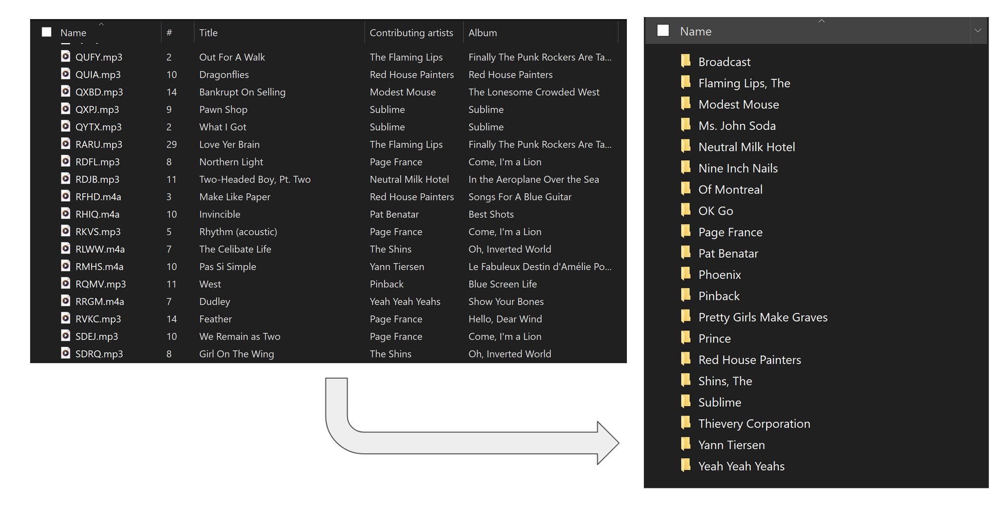
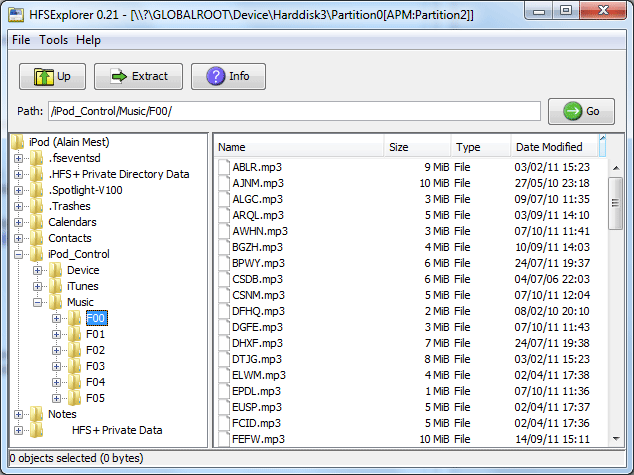

# Music Library Organizer by Tag

This program organizes and renames batches of music files into a directory of folders based on tag information.

This tool is particularly handy for transferring music from an iPod to your computer since iPods organize music in this bizarre and obfuscating way that is meant to only be recognizable to iTunes. 

This program will walk through any subfolders within a given root directory and organize all files contained therein into a destination directory of artist and album folders based on the metadata. All filetypes supported by TinyTag are supported by this script; see the [TinyTag documentation](https://pypi.org/project/tinytag/) for more information.

## Some considerations

Make sure you have accurate tag information for the files you are feeding into the program. For instance, if you have some songs with the artist name as "The Beatles" and other songs with the artist name as "Beatles", this will create two separate folders for each. 

Songs with no artist information will be dumped into a folder called "~ No artist" and songs with no album information will be plopped directly into the artist folder.

Feel free to modify and resdistribute this program however you wish.